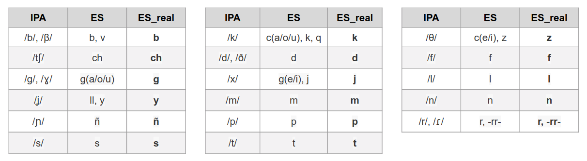

# es2ipa (Spanish to IPA)

This project is divided in two parts:

- ES > ES_real
- ES > IPA

### 1. ES > ES_real
This part takes written Spanish as input and returns how it is actually pronounced (in Spain) according to the following criteria:

- **Consonants**.



- **Vowels**.


- **Diphthongs** / **Triphthongs**.


*Examples:* &nbsp;&nbsp;&nbsp;&nbsp;&nbsp; amigo: **amigo** &nbsp;&nbsp;&nbsp;&nbsp;&nbsp; exnovia: **eksnobïa** &nbsp;&nbsp;&nbsp;&nbsp;&nbsp; cuello: **küeyo** &nbsp;&nbsp;&nbsp;&nbsp;&nbsp; cielo: **zïelo**

- **Accents** and **apostrophe**.
	- All words with none-paroxytone stress are accentuated, including monosyllabic words. **Exception**: unstressed monosyllables -- like some prepositions or connectors.
		
		*Examples:* &nbsp;&nbsp;&nbsp;&nbsp;&nbsp; pájaro: **pájaro** &nbsp;&nbsp;&nbsp;&nbsp;&nbsp; arroz: **arróz** &nbsp;&nbsp;&nbsp;&nbsp;&nbsp; pez: **péz** &nbsp;&nbsp;&nbsp;&nbsp;&nbsp; que: **ke**
	
	- The apostrophe is used to link words which are pronounced as one, either because of vowel diphthongization or because of consonant link. When two or more words are joined by an apostrophe only the stressed syllable/s are accentuated, even if they are paroxytone.

		*Examples:* &nbsp;&nbsp;&nbsp;&nbsp;&nbsp; te incluyo: **te'ïnklúyo** &nbsp;&nbsp;&nbsp;&nbsp;&nbsp; pura agua: **pur'ágüa** &nbsp;&nbsp;&nbsp;&nbsp;&nbsp; bien visto: **bïém'bísto**

#### Example

Source: (```Don Quijote de la Mancha```)

```«En un lugar de la Mancha, de cuyo nombre no quiero acordarme, no ha mucho tiempo que vivía un hidalgo de los de lanza en astillero, adarga antigua, rocín flaco y galgo corredor».```

Output: (```Don'Kixóte de la Mancha```)

```«En'ún lugár de la Mancha, de kuyo nombre no kïero akordarme, no á mucho tïempo ke bibía'ün'idálgo de los de lánza'en'astiyéro, adarga antigüa, rozín flako i galgo corredór».```
### 2. ES > IPA
This part transforms written Spanish into IPA representation.
